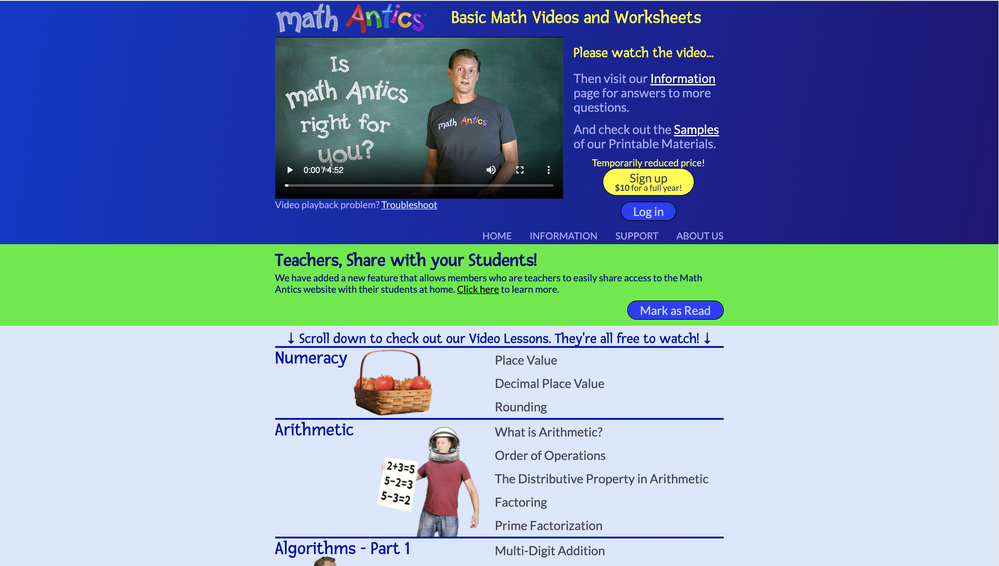
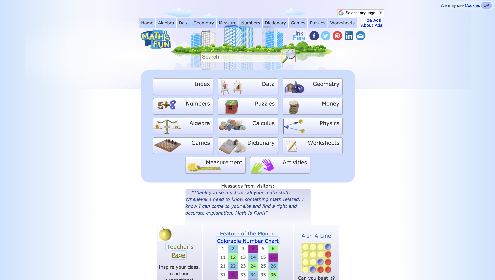

# Websites Focused in Providing Academic Resources for Teachers Who Are Middle-aged Women
## Garrett Romero - Digital Humanities 250
### Description: In the age of COVID-19, remote teaching has become mandatory for the educational world. Teachers are forced to utilize various technologies in order to facilitate and execute their lesson plans on a daily basis. The scope of this project focuses on how middle-age women, who are teachers in elementary school, engage with websites that provide supplemental academic resources for their lessons. The goal of this project is to help identify usability improvements for two website competitors that provide academic resources, which midddle-aged women who are teachers utilize on regular basis. In order to achieve the projects goal, a  heuristic evaluation will be conducted to understand what works well and what are the pain points to create better remote learning experiences.  
----
## Heuristic Evaluations
### Website Name: Mathantics
### Website URL: https://mathantics.com/
### Website Screenshot: 
### Overall Evaluation:
Recommend updating button icons to clearly define status. Needs to be designed with an aesthetic and minimalistic focus. There is too much clutter going on just on the landing page alone to overwhelm the user. More importantly, when it comes to the design process, standardization and consistency need to be focused on given the current state of presenting buttons and hyperlinks to the user. 
### Mathantics Heuristic Evaluation
| Heuristic Principle      | Severity Ranking | Comments     |
| :---        |    :----:   | :----         |
| Visibility of system status      | 1 | The status of system is adequately conveyed on the website. When hovering over buttons with embedded hyperlinks on the website, they either change color or the cursor changes from pointer to a hand with index finger sticking out. Moreover, when engaging with the video content, it provides play/stop options and a status bar to signify whether or not the video is playing and where it is specifically on the timeline. While the system conveys status to the user, it can be hard to differentiate due to some buttons on the website not being clearly designed as buttons. A user needs to drag their cursor over some buttons in order to convey a proper status. |
| Match between system and the real world   | 2        | The landing page is complex and confusing. Specifically, there are many things going on with the landing page that tend stray away from real world expectations of navigating websites. Notifications and button options are out of place and hard to follow. Specifically, notification and button options are placed all over the landing page creating a zig-zagging effect. Moreover, the landing page leads directly to the video content. While this makes sense, it provides an overwhelming display of information and content. In comparison to traditional websites, where it’s welcoming and allows the user to naturally engage with main header options, this site crams everything all onto the landing page.  |
| User control and freedom      | 0 | Mathantics sufficiently provides user control and freedom. The Mathantics logo button is clearly displayed and visually defined as the home button. Additionally, as a user engages with video content, there is a ‘Previous’ and ‘Next’ option that allows the person to backtrack to previous and upcoming content. Moreover, the subscription section of the page allows you to ‘cancel’ in case you did not want to commit to a subscription.  |
| Consistency and standards   | 3 |  Mathantics internal consistency needs major improvement. The various buttons and options highlight to different colors which tends to display a lack of standardization. While it is relevant for all the buttons, the greatest lack of consistency occurs with the hyperlinks. The ones directly associated to the landing page do not indicate any color change while the ones located at the bottom do indicate change to a different color when hovering the cursor over the hyperlink. More broadly, the website branding, especially when it comes to background colors, is not uniform. The landing page and the main child pages associated to the header bar options have different color themes (blue, green, and light pale blue) in comparison to the video content pages (blue and light pale blue). Albeit, the green color is conveying a specific website status but it does not fit in with the color themese and causes initial confusion. Lastly, there is no search query bar embedded into the website. For a website that hosts content, a search query bar is standard practice and fairly important. |
| Error prevention      | 1 | Mathantics does provide standard error prevention options throughout its website. The main graphic logo, that acts as the home button, is properly placed on the site to make it easily identifiable for users. The account login section of the site provides ‘Forgot Password?’ and ‘Forgot Your Email?’ options to allow a user to successfully recover their account. Lastly, the horizontal direction arrows associated to the video content is well established, allowing a user to backtrack to previous content if necessary. The only critique would be to define the home button clearly. Currently, it looks like graphical font instead of a home button logo.  |
| Recognition rather than recall   | 1 |  Mathantics is a fairly straightforward website with not much need for sophisticated recognition features. It comes equipped with the standard home button logo to help users recognize the option for navigating back to the landing page. Some little features, like actual arrow graphics (<) (>) being placed next to ‘Prev’ and ‘Next’ does engage with recognition and gives the user easier understanding of navigational direction between content pages. One area that the website does engage with recall versus recognition is the hyperlinks that navigate to their social media pages. The website utilizes text over logos, which is less identifiable to users recognition. A user would be able to utilize 'chunking' recognition if social media logos were implemented. |
| Flexibility and efficiency of use      | 3 |  Mathantics is literally a point and click website with a primary focus in providing video content. There are not many control options required and is solely dependent on the cursor of the mouse to enable command functions. However, the video content is displayed on the landing page and requires a scroll through in order to identify a specific video. There is no search query bar, making the navigation of the web page to be restricted, especially in regards to information seeking behavior. |
| Aesthetic and minimalistic design   | 3 |  The Mathantics website needs a re-design when it comes to aesthetics and design. The landing page is overwhelming and inundated with many options and content. It is so overwhelming that many buttons that provide important, supplemental content gets lost in translation. Moreover, the video content is directly associated onto the page making the purpose of the landing page focused on video content instead of other important aspects that the website offers. More importantly, the colors of the website are overwhelming. The one area of design that Mathantics is efficient at is presenting the individual video content on sub-child pages, where there is not much clutter in terms of information.  |
| Help users recognize, diagnose, and recover from errors      | 0 |  Mathantics does help users recognize, diagnose, and recover from errors fairly well. The account login fields provides specific options for a user to recover their account in case one or all of the credentials are lost. More importantly, Mathantics provides additional support to help a user recover an account by allowing the person to reach out for administrator help.  |
| Help and documentation   | 0 |  Mathantics provides a support page for troubleshooting various issues, such as sign-up problems, login issues, video playback trouble, and issues accessing supporting documentation with PDF’s. This support page specifically lists out concrete step-by-step instructions to help troubleshoot issues listed on the page. Additionally, it provides a Frequently Asked Questions (FAQ) page that answers a diverse set of questions. More importantly, it provides an email address to reach out to for administraor support in case a user still has issues or questions utilizing the website platform.   |

### Website Name: Math is fun
### Website URL: https://www.mathsisfun.com/
### Website Screenshot: 
### Overall Evaluation:
Recommend changing the graphic icons to change to a different color. The next design should think about possibly incorporating a shaded backgrounded effect to the graphic icons in order to give a clear status of the system. More importantly, the horizontal direction arrows need to be re-worked in order to allow greater user control and freedom, and to allow users to recover from errors and engage in recognition versus recall. Additionally, the design process should incorporate a consistent approach when placing graphic logos alongside content options. 
### Mathantics Heuristic Evaluation
| Heuristic Principle      | Severity Ranking | Comments     |
| :---        |    :----:   | :----         |
| Visibility of system status      | 1 | System status is very well conveyed on this site. Buttons are clearly defined and change different colors when hovering over them. This is consistent throughout the entire website. When engaging with the search bar, it will immediately use predictive searching and begin populating the page with results as you go along. In my opinion, this is conveying to the user in real time of the search function performing the user query. Moreover, when a user is performing math equation problems on the website, it will automatically signal whether the user got it right or wrong. Where status is not clearly conveyed is through the graphic icons on the worksheet page not changing color. The cursor only changes to a hand with index finger to signify system status.  |
| Match between system and the real world   | 2  | The Mathisfun website landing page does a good job of matching system to real world expectations. However, the child pages linking to the header bar tend to deviate from this aspect. The design logos are not placed in a uniform manner, which may have the user engage visually with the content in a left-to-right or right-to-left manner.         |
| User control and freedom      | 3 | Mathisfun does provide user control and freedom, however, it is not consistent. Upon selecting the various categories displayed (algebra, geometry, etc.) on the header bar, a user does have directional functions to move forward or backwards with the content associated to it. A great example of this is the Algebra section. However, what becomes conflictual is that there is too much user control and freedom while simultaneously lacking it. Where there becomes too much user control and freedom is that there are two sets of horizantal direction arrows, which can confuse the user of where to navigate. Alternatively, once you’ve reached the final content page for the Algebra section, the directional arrows are non-existent and force the user to start over. This is not a one off occurence and seems to be a consistent throughout the other child pages. |
| Consistency and standards   | 1 |  Mathisfun's internal consistencies are executed well on this website. All the buttons are a consistent yellow theme color when the cursor hovers over them. More importantly, the branding and theme of the website is consistent throughout every child page. The only consistency issue that should be addressed is with the horizontal direction arrows that was discussed in the ‘User control and freedom’ section.  |
| Error prevention      | 1 |  Mathisfun has good error prevention. The website is opensource and does not require login credentials, which removes a lot of error scenarios with user login issues. It also has a clearly established home button logo to allow users to navigate back to the landing page in case a person needs to start over. Moreover, when engaged with the math problems on the site, it will prompt an error message if the user selects a wrong answer. Lastly, as mentioned previously, the Mathisfun website successfully employs horizontal direction arrows for navigation and can allow a user to backtrack to previous content if necessary. However, the directional arrows are not consistent and does not successfully prevent error throughout the entire website.  |
| Recognition rather than recall   | 2 |  Mathisfun does promote recognition versus recall. While the website is fairly straightforward, where it excels in recognition is the graphics associated to the math categories on the landing page. The graphics are thematically associated with the category allowing a user to search and recognize the content in an easy manner. Also, the use of social media logos for hyperlinks instead of alphabet characters allows a user to easily identify which social media platforms they operate on. However, the one area where it does rely on recall versus recognition is when the navigational arrows to switch between content become non-existent. Once the arrows are removed, then the user needs to remember how to get back to previous content that was explored. |
| Flexibility and efficiency of use      | 0 | Mathisfun provide the most flexibility and efficiency of use through its search query. A user may select individual alphabet categories in order to narrow their scope of searching or type something specific into the search query bar. What makes the search query bar efficient is that it utilizes predictive searching to make search recommendations and to identify content easier.  |
| Aesthetic and minimalistic design   | 1 |  The overall website of Mathisfun is aesthetically pleasing and minimalistic at heart. When you engage with the specific content on each child page, the categories are clearly laid out without much clutter. Even on the specific content pages, information is concisely laid out, with minimal text explanation while relying on the graphical content to explore each learning theme. Where it fails the minimalistic approach is on its landing page. While the primary option to access the content are relevant and showcased, there is supplemental content that does not flow with the primary information on the landing page. It looks as if it is taking up space for the sake of taking up space. This should be addressed and removed from the landing page to be repurposed elsewhere on the website. |
| Help users recognize, diagnose, and recover from errors      | 0 |  Mathisfun helps users recognize, diagnose, and recover from errors in a specific manner. When users are engaged with solving math problems on the website, a user may select the wrong answer. If this occurs, a status update signals to the user that they have selected the wrong answer, explain what answer is correct and why it is correct. More importantly, a user can select the correct answer after the mistake allowing the person to recover in an easy process. |
| Help and documentation   | 1 |  Mathisfun does not have any supporting documentation that can help a user troubleshoot any issues. The most the website offers in terms of support is a feedback/contact option that allows users to reach out to the website administrator team. The only reason why the severity ranking is not as high is because the website is open source and easy to navigate. |

