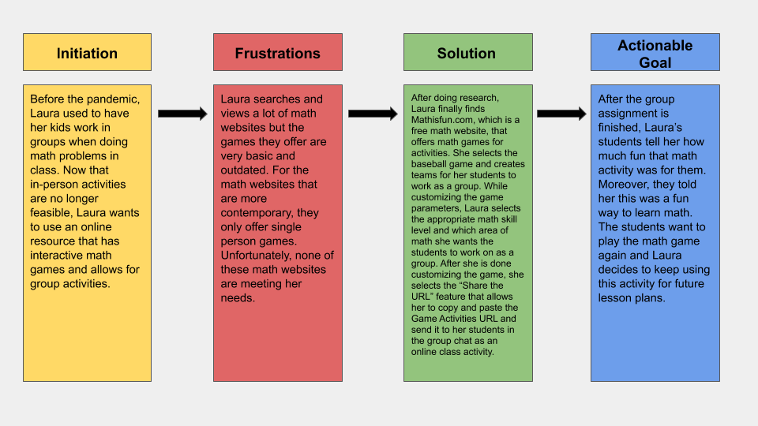

# Personas & Scenarios
## Introduction

Storytelling in UX is one part research, one part artform. To craft a user's story, you need the data to bring actionable insights to light. However, data is not enough. You need to tell a story with that data to encompass the users your feature/product is targetting, which is a true artform in of itself. The purpose of storytelling in UX is simple: it is to drive design through emotion. When you are presenting a story to the stakeholders, they are not looking for granular insights from the research data. More often than not, they're looking for what makes a user frustrated and what they can do to solve that frustration. Ultimately, storytelling puts the stakeholders in the users shoes and removes any biases or assumptions they may have when they are crafting a feature or product for their consumers. 

## Personas
### Laura Q - The Math Guru

### Josephine R.  - The Bored Math Student

----
## Scenarios
### Laura Q's Scenarios
_**Scenario 1**_

**Why is Laura using this product**

Laura is a grade school teacher based in Los Angeles. She has always used online math resources for supplemental teaching purposes but she usually printed out homework assignments to hand out to her students. Because of COVID, Laura finds herself using sites like Mathisfun.com more often to assign homework assignments to her students. Laura wants to assign some worksheets that are on Mathisfun.com to her students for an upcoming homework assignment, however, she wants to customize the questions to make them more relevant to the multiplication material they’ve been learning in class lately. 

**How is Laura using this product**

Laura goes to the Mathisfun.com website and selects the Worksheets button located on the landing page. She identifies the Multiplication worksheets option and it opens up to the various worksheets based on a many categories for math. Laura selects the Getting Tougher multiplication worksheet and reviews the math problems. She notices that some of the math problems may be too difficult for her students to solve. Laura then selects the ‘Customize Math Problems” option and modifies the questions to be more suited for the students skill level. After she completes her modifications, Laura saves the worksheet and then clicks the “Share the URL” feature that allows her to copy and paste the math worksheet URL and send it to her students via email or chat.   

**Customer Journey Map**

_**Scenario 2**_

**Why is Laura using this product**

Laura is a grade school teacher that currently facilitates her classes online. Before the pandemic, Laura was able to create fun and interactive math games that her students could participate in class. Since in-person activities are longer feasible, she wants to try out an online interactive math learning activity with her students where they can work on this activity together. Laura knows kids learn best when they engage in visual activities that capture their attention and when they work on it as a group.   

**How is Laura using this product**

Laura goes to the Mathisfun.com website and selects the Games button section. She identifies Team Games and selects the Baseball option. Inside the game, she customizes it based on her needs and parameters. She chooses two teams competing against each other and gives each team a name. Also, she selects the math category and sets the skill level based on the students grade. After she is done customizing the game, she selects the “Share the URL” feature that allows her to copy and paste the Game Activities URL and send it to her students via the group chat on Zoom.

**Customer Journey Map**

### Josephine R's Scenario

**Why is Josephine using this product**

Josephine is trying to complete an online math worksheet assigned by her teacher that is based on multiplying numbers. When she’s working on math problems in class, her teacher allows her to use shortcuts such as math songs, pictures of her times tables, and objects to manipulate that help solve multiplication problems. Josephine gets stuck on a math problem and decides to see what the online website has for helpful math tools to help her solve the problem.   

**How is Josephine using this product**

Josephine is working on a multiplication problem she’s having trouble with and needs help. She looks for the Math Toolkit button located at the bottom-right of the webpage. She selects the button and a menu fans out giving her options to choose from, such as video tutorials, math shortcuts, digital objects to manipulate and more. Josephine decides to select the Math Shortcuts option to help her solve the multiplication problem.  

**Customer Journey Map**

----

## Reflections
Admittedly, this has been one of the more difficult assignments to date. One of the reasons that comes to mind is that storytelling in this manner has always been difficult for me. Specifically, I have always had trouble crafting user personas that drive design through emotion. Moreover, while I have done user personas in the past, this execercise was particularly challenging because I am using data from past assignments to tie into this one. I haven't tied data into actionable user personas before, so it was a little bit intimidating for me. However, I still enjoyed this aspect of the assignment because I get to focus on one my weaknesses as a aspiring UX professional. Another thing to note about the user persona exercise is that I felt really confident in crafting the teacher, however, I felt the student persona was a little weak. The reason why I felt the student persona was weak is because I was using data primarily based off the user interview from the teacher. Also, it was my only interview so it is not like I had many options. There was good information to go off of from the data of the interview but I felt that a separate interview with a student to fit the demographic would have been more suitable. However, I do realize interviewing students in that age category inherently comes with a lot more red tape and would have taken too long to get approval in order to finish this assignment on time. I could be entirely wrong about my analysis but I will wait till the final evaluation to see what I can do better. 

Another challenge with this assignment is that I have never done scenarios or customer journey maps before. This was a whole new area of practice that I have not touched on before until now. It is interesting to note how this drives design. It really helps you break down the use case for the features you want to design for the product. Specifically, one of the features that I wanted to include in the design process was a particular way of doing a group exercise. However, after writing out the scenario, it became evident that I needed to highlight the data findings more effectively, especially from the the persona I was using, to make the idea relevant and intriguing. I actually look forward to this idea and hopefully I can pull it off with the Lo-Fi wireframe assignment. 
