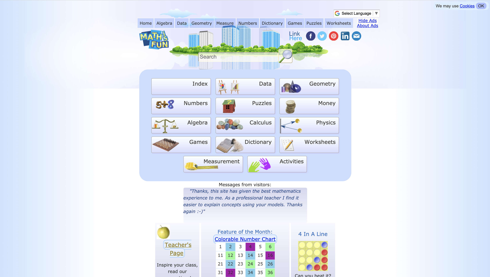
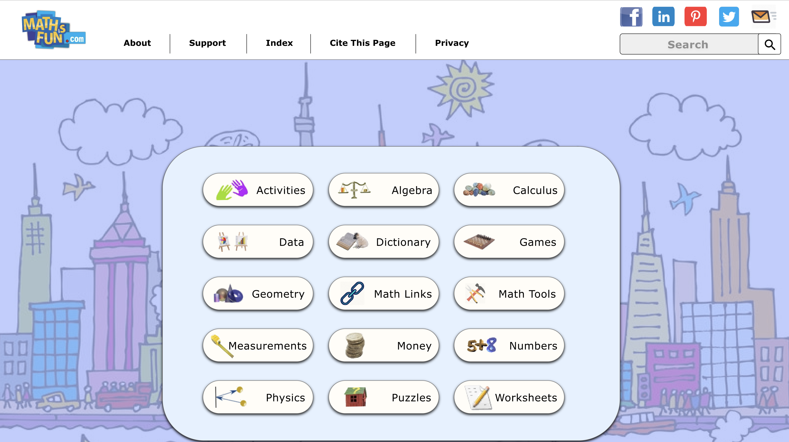
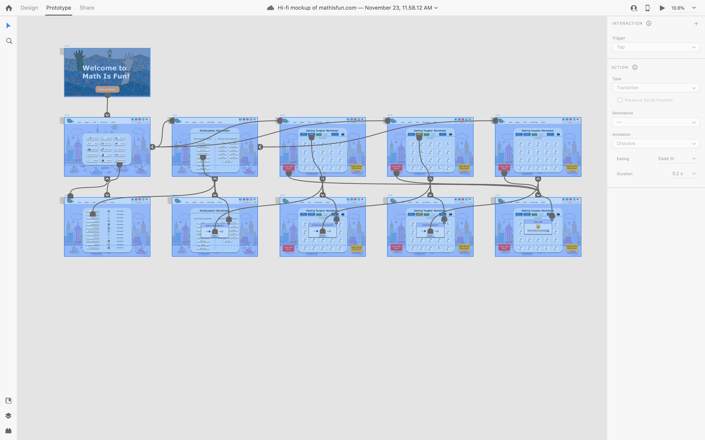
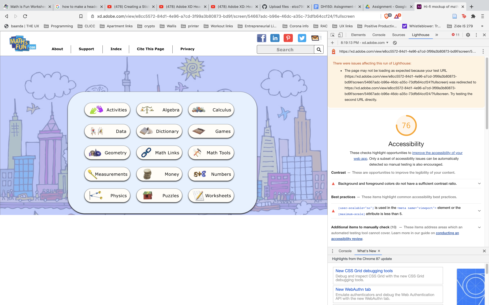

# High Fidelity Prototype
## Introduction
The purpose of this high-fidelity prototype is to translate the research that has been conducted on the [mathisfun.com](Https://www.mathisfun.com) website and present design concepts and improvements from the findings. More importantly, high-fidelity prototyping allows the design concept to be tested and iterate design improvements based on feedback and findings from Impression Tests and Cognitive Walkthroughs. To bring concept to reality, the Adobe XD prototyping tool was utilized to make an iterative, high-fidelity design based on the low-fidelity design initially mocked up from the Balsamiq software platform. While this high-fidelity prototype's tasks are created based on one scenario, this is not the final design outcome! 

----
## Graphic Design Decision Making Process
The overall layout, in terms of graphics, icons, and color schemes, is all based on the current mathisfun.com website. The website had received a 98/100 accessibility score, especially in terms of color. Moreover, I wanted to implement a form of recognition versus recall, so that way users could identify and engage with some of the changes made while having a sense of comfort based off a familiarity feeling. Lastly, the primary font utilized in the prototype is Verdana, which is representative to the current website, but it may be subject to change for the final iteration. To utilize the same colors, icons, and fonts, I utilized a plug-in tool from Adobe Xd that helped capture these elements. One of the biggest changes implemented was creating a simple Welcome page. I remember from the usability testing, the test subject stated that the website felt boring and one of the 'original websites from the 90's.' More importantly, he stated that kids needed to be engaged with contemporary concepts. It is with this in mind that I implemented a Welcome page because I want the user to feel like they are about to enter a math journey that is exciting. It could be too much so I am open to suggestions on this aspect.

Some of the other noticeable changes is establishing consistent buttons throughout the website. For example, if you were to see how the Math Worksheets [webpage](https://www.mathsisfun.com/worksheets/index.php) is laid out, then you would notice that it uses hyperlinks. I wanted many of these links to be visually identifiable based on best practices and therefore converted them to buttons. Another big change I implemented was making the landing page more efficient and less cluttered. Specifically, I got rid of the old header bar because it was redundant and not needed. I replaced the header bar with a clean look and converted the Footer buttons into header buttons, which seemed appropriate in terms of information. Lastly, the current website had a lot of unnecessary of background space, which gave the feeling of emptiness. While my current design has the same layout in terms of background, I did out in place a a background image to give the design more depth while catering to the themes of audience. Overall, I implemented a less is more approach for the design process. I felt like the little changes to layout will have the greatest impact. 

----
## Prototype Tasks
This prototype supports tasks that are based off of scenario 1 from the Laura Q. user persona (for reference, please click [here!](https://github.com/elco7985/DH250-Romero_Garrett/tree/main/Assignment%2005)). Based off the scenario, the user is supposed to go through the workflow and process as so:
* Select 'Worksheets' from the Landing page
* Select the multiplaction worksheet, Getting Tougher'
* Customize 'Getting Tougher' worksheet
* Copy URL from the customized 'Getting Tougher' worksheet 

Future Tasks to be included in the final prototype design are:
* Customizable math baseball game for group activities based on scenario 2 of Laura Q's user persona with Copy URL function
* Math toolkit shortcut based on Josephine's user persona

----
## Prototype Images

----
### Before

### After

### Entire Mockup

----
## Wireflow

----
## Impression Test & Cognitive Walkthrough
### Notes
**Impression Test**

*What do you see?:*
* I see on the welcome page, click to enter
* Landing page - symbols make sense
* Online confusing
* May be clearer for people familiar with the website
* Does she have to work online or offline?
* Copy Button seems a little small
* Doesn’t know what the smiley face is all about*

*What do you think about the webpage?*
* Seems fine
* Simple to use
* Not too much going
* Probably good for kids and teachers
* Colors of the buttons
* Red for Copy URL is questionable

*What do you think you can do with this webpage?*
*  Math stuff
* These are accurate

*Any Other Comments?*
*  Looks really good

**User Persona and Cognitivw Walkthrough scenario**

*Do you think users can understand what the screens feedback is all about?*
* Yes
* Except for online worksheet.. Maybe
* Question can possibly be framed “how do you want to work on this? Online or offline?”

*Do you think users can recognize the interaction points and information?*
* She thinks so

*Do you think the users can feel that the progress is being made toward what they want to achieve?*
* Yeah

*Do you feel that users would know what to with the steps?*
* Yes

**Explain back-flow, how to cancel/exit/return to the beginning**

*Is there anything inconsistent, missing, or confusing?* 
* Doesn’t seem to be an exit strategy for the Math Worksheets Page
* Worksheets table of contents
    ** Either make it a pop up with X or
    ** Add home button to header bar

### Video Link
To access recording of Impression Test & Cognitive Walkthrough, please click [here!](https://drive.google.com/drive/folders/1lShCC0MU6rbITE1A-qcLzI5bl4JzJdXA?usp=sharing)

----
## Accessibility Test

----
## Reflections
The overall process of learning Adobe Xd was admittedly challenging but rewarding. After viewing a few tutorials to institute some of the basic design styles, designing became a straightforward process. I really love the versatility of Adobe Xd and I think it will be a tool that I'll continue to use in the future (however, I do want to explore other hi-fi prototype tools as well). Some of the immediate things that I want to learn in the future with Adobe Xd is to see how it exports a design mockup into actual code. Specifically, I want to see what the process looks like and where coding skills is required once you've exported the design mockup. Another area I want to explore is understanding more advanced design techniques that have to do with scrolling through a webpage/app and enabling animations to make the design prototype more authentic. I don't know if I'll be able to achieve these skills by the end of the quarter but they are goals that I aim to accomplish nonetheless. 

In terms of implementing an Impression Test and Cognitive Walkthrough, I really enjoyed the value of feedback that came from my classmates and my user tester (aka my wife). Throughout the design process, it was very much like a puzzle to me - very creative but detail-oriented. I love this aspect of designing, especially when it comes to workflows, because I genuinely love making things more efficient. However, much like a puzzle you can stay focused on a specific area for a long-time and accidentally miss some design flaw along the way. With both sets of feedback, I was able to institute some changes from the initial design that weren't initially reflected. Specifically, adding an exit button, color-banner, and enter button to the warning pop-up windows. Also, I plan on re-wording the Online pop-up window to make it more easily to understand what the feature is supposed to do. Moreover, I do plan on reviewing and implementing additional feedback from the Impression Test and Cognitive Walkthrough for the final iteration of the design.

