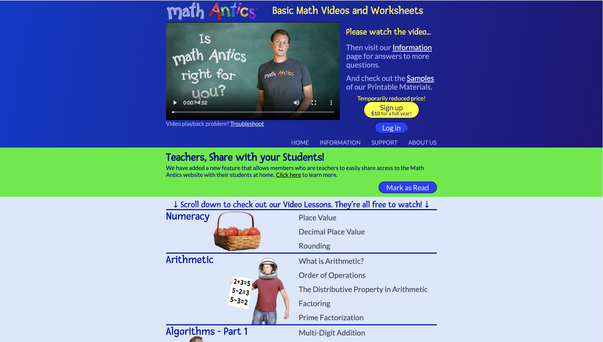
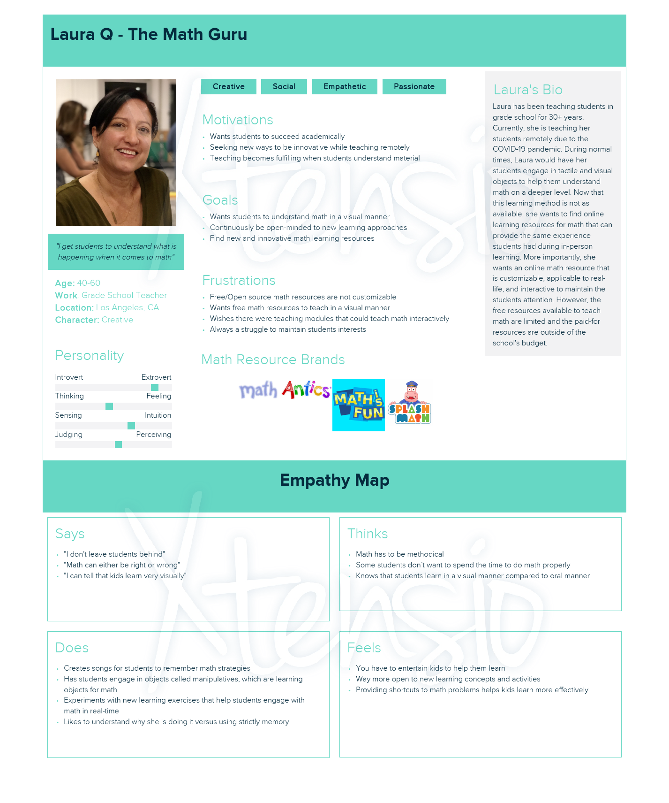
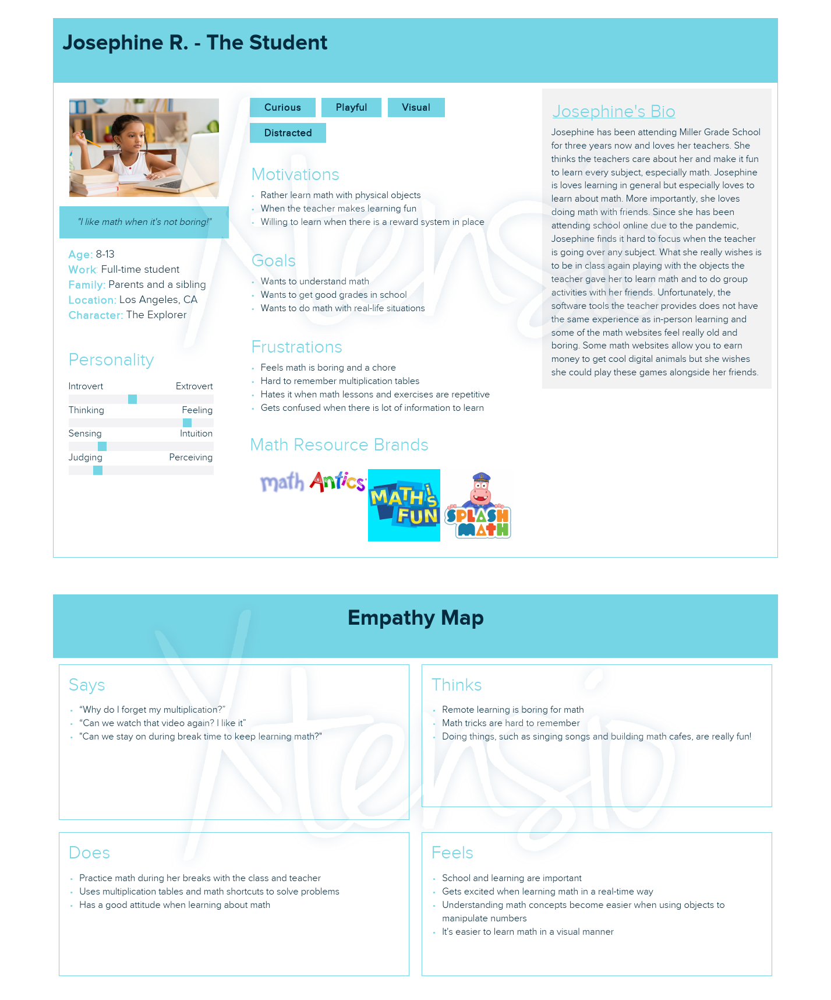
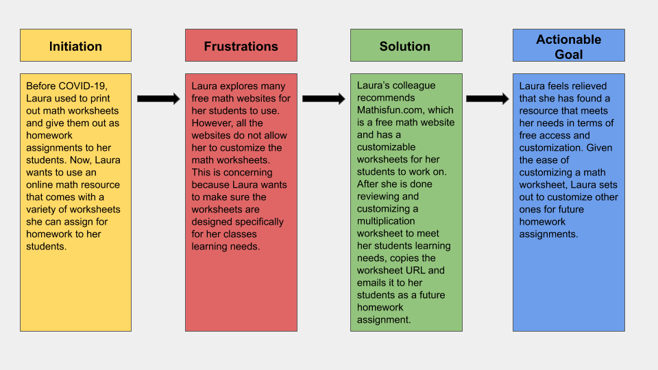
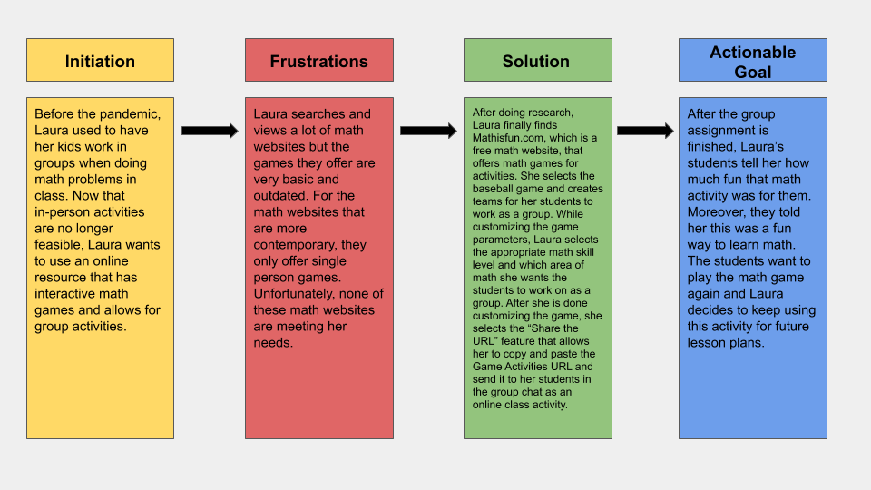
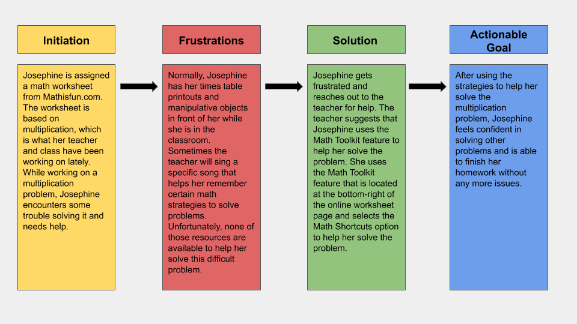
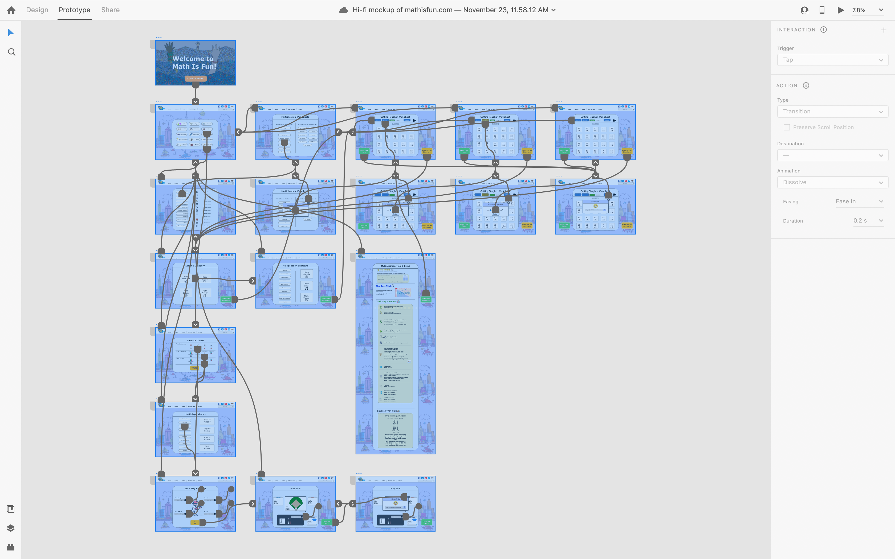

# Improving Open Source Learning Platforms for Teachers
### by Garrett Romero

----
## Introduction
Given the current conditions of the COVID-19 pandemic, I noticed a strong trend in news reports and Twitter posts of how teachers and students alike were struggling with the new normal of online learning. More importantly, I know first hand how online learning tools can come at a cost that is well beyond the budget of a teacher's salary. Using my Aunt Janet as inspiration, who has been a world class teacher for over 30 years, I set out on a UX journey to help improve an opensource online learning tool that could positively impact a learning environment.     

----
## Design Statement
### How can I create a positive user experience for online and opensource learning platforms that teachers can effectively use for teaching their students during the COVID-19 pandemic? 
The parameters of the research study required identifying a digital platform that was frequently used by middle-aged women, either web or app related, and improving the overall usability and user experience. Given the requirements of the study, I identified opensource learning platforms used by teachers as area for improvement. After initial 

----
## Competitor Analysis: Heuristic Evaluation
In the age of COVID-19, remote teaching has become mandatory for the educational world. Teachers are forced to utilize various technologies in order to facilitate and execute their lesson plans on a daily basis. The scope of this project focuses on how middle-age women, who are teachers in elementary school, engage with websites that provide supplemental academic resources for their lessons. The goal of this project is to help identify usability improvements for two website competitors that provide academic resources, which midddle-aged women who are teachers utilize on regular basis. In order to achieve the projects goal, a heuristic evaluation will be conducted to understand what works well and what are the pain points to create better remote learning experiences.

Mathantics.com | Mathisfun.com
--- | --- 
 | 

For complete heuristic evaluation of both websites, please click [here!](https://github.com/elco7985/DH250-Romero_Garrett/tree/main/Assignment%2001)

----
## Competitor Analysis: Usability Testing
In today's COVID-19 reality, remote learning has become required and additional educational resources are becoming even more important to facilitate effective this new reality. The Math is fun website is an educational resource for mathematics supplemental learning. It provides math examples, simple how-to videos, math worksheets and quizzes and more. My initial impressions are that I found the website fairly straight forward and did not overwhelm me with information based on the landing page. However, after conducting the heuristic evaluation, based on Jakob Nielsen's 10 principles, I found a few violations that potentially impacted usability of the website. Specifically:

* **User Control & Freedom:** Mathisfun does provide user control and freedom, however, it is not consistent. Upon selecting the various categories displayed (algebra, geometry, etc.) on the header bar, a user does have directional functions to move forward or backwards with the content associated to it. What becomes conflictual is that there is too much user control and freedom while simultaneously lacking it.
* **Match between system and the real world:** The child pages linking to the header bar tend to deviate from this aspect. The design logos are not placed in a uniform manner, which may have the user engage visually with the content in a left-to-right or right-to-left manner.
* **Recognition rather than recall:** The area where Mathisfun does rely on recall versus recognition is when the navigational arrows to switch between content pages become non-existent. Once the arrows are removed, then the user needs to remember how to get back to previous content that was explored.
* **Consistency and standards:** The consistency issue that should be addressed is with the horizontal direction arrows that was discussed in the ‘User control and freedom’ section.

<iframe src="https://drive.google.com/file/d/1F4KBqz1NnSLknXbvfSRyWWU8qg1VVjiz/preview" width="640" height="480"></iframe>
----

## User Research: Contextual Inquiry
Based off the initial findings of the Mathisfun.com [heuristic evaluation](https://github.com/elco7985/DH250-Romero_Garrett/tree/main/Assignment%2001) and [pilot usability test](https://github.com/elco7985/DH250-Romero_Garrett/tree/main/Assignment%2002), the research has reached its next phase of data collection. The research that takes place is based on participant observation and contextual inquiry user experience methodology that is focused at collecting qualitative data towards facilitating effective math learning lessons to students in and outside of classroom learning. Specifically, the research observes and explores the tools, strategies, and pain points of teaching math to a group of elementary school children by a female, middle-aged teacher based in Los Angeles, California. The ultimate goal is to identify translatable qualitative data that can be used to help improve and/or create new features pertaining to the Mathisfun.com website.

### Participant Observation
<iframe src="https://drive.google.com/file/d/1Y2HhCeqS1saVM6kt_Unwmy1PSmQl1bGg/preview" width="640" height="480"></iframe>

### Contextual Inquiry
#### Part 1
<iframe src="https://drive.google.com/file/d/1uLDuG7HIdbIbriwXasF9gbY06XXT_5eT/preview" width="640" height="480"></iframe>
#### Part 2
<iframe src="https://drive.google.com/file/d/11x5gxxiMD-Z-DIb8ynQPFyU1XJZiWM37/preview" width="640" height="480"></iframe>

----

## UX Storytelling
Storytelling in UX is one part research, one part artform. To craft a user's story, you need the data to bring actionable insights to light. However, data is not enough. You need to tell a story with that data to encompass the users your feature/product is targetting, which is a true artform in of itself. The purpose of storytelling in UX is simple: it is to drive design through emotion. When you are presenting a story to the stakeholders, they are not looking for granular insights from the research data. More often than not, they're looking for what makes a user frustrated and what they can do to solve that frustration. Ultimately, storytelling puts the stakeholders in the users shoes and removes any biases or assumptions they may have when they are crafting a feature or product for their consumers.
### User Personas & Empathy Map

### Scenarios & Customer Journey Maps
#### Laura Q's Scenarios
_**Scenario 1**_

**Why is Laura using this product**

Laura is a grade school teacher based in Los Angeles. She has always used online math resources for supplemental teaching purposes but she usually printed out homework assignments to hand out to her students. Because of COVID, Laura finds herself using sites like Mathisfun.com more often to assign homework assignments to her students. Laura wants to assign some worksheets that are on Mathisfun.com to her students for an upcoming homework assignment, however, she wants to customize the questions to make them more relevant to the multiplication material they’ve been learning in class lately. 

**How is Laura using this product**

Laura goes to the Mathisfun.com website and selects the Worksheets button located on the landing page. She identifies the Multiplication worksheets option and it opens up to the various worksheets based on a many categories for math. Laura selects the Getting Tougher multiplication worksheet and reviews the math problems. She notices that some of the math problems may be too difficult for her students to solve. Laura then selects the ‘Customize Math Problems” option and modifies the questions to be more suited for the students skill level. After she completes her modifications, Laura saves the worksheet and then clicks the “Share the URL” feature that allows her to copy and paste the math worksheet URL and send it to her students via email or chat. 

_**Scenario 2**_

**Why is Laura using this product**

Laura is a grade school teacher that currently facilitates her classes online. Before the pandemic, Laura was able to create fun and interactive math games that her students could participate in class. Since in-person activities are longer feasible, she wants to try out an online interactive math learning activity with her students where they can work on this activity together. Laura knows kids learn best when they engage in visual activities that capture their attention and when they work on it as a group.   

**How is Laura using this product**

Laura goes to the Mathisfun.com website and selects the Games button section. She identifies Team Games and selects the Baseball option. Inside the game, she customizes it based on her needs and parameters. She chooses two teams competing against each other and gives each team a name. Also, she selects the math category and sets the skill level based on the students grade. After she is done customizing the game, she selects the “Share the URL” feature that allows her to copy and paste the Game Activities URL and send it to her students via the group chat on Zoom.

#### Josephine R's Scenario

**Why is Josephine using this product**

Josephine is trying to complete an online math worksheet assigned by her teacher that is based on multiplying numbers. When she’s working on math problems in class, her teacher allows her to use shortcuts such as math songs, pictures of her times tables, and objects to manipulate that help solve multiplication problems. Josephine gets stuck on a math problem and decides to see what the online website has for helpful math tools to help her solve the problem.   

**How is Josephine using this product**

Josephine is working on a multiplication problem she’s having trouble with and needs help. She looks for the Math Toolkit button located at the bottom-right of the webpage. She selects the button and a menu fans out giving her options to choose from, such as video tutorials, math shortcuts, digital objects to manipulate and more. Josephine decides to select the Math Shortcuts option to help her solve the multiplication problem.  

----
## Low-Fidelity Prototype
To provide a brief recap, the goal of the design project is to identify frustrations, pain points, and potential usability opportunities for users who are middle-aged women. The selected website, Mathisfun.com, was chosen to target middle-aged women who were teachers and a series of methodologies was implemented to gather actionable qualitative data. Based on the data collected throughout the entire research, the next phase is to create a low-fidelity wireframe and prototype to present and test out with pilot users. The purpose of the low-fidelity wireframes is to see the system functionality and usability on the potential features being incorporated into the design. The following features were recommended based off the [User Personas and Customer Journey Maps](https://github.com/elco7985/DH250-Romero_Garrett/tree/main/Assignment%2005):

* Customization feature to tailor math worksheets
* Copy URL function to send customized/non-customized worksheets to other users
* A ‘Math Toolkit’ shortcut feature that leads a user to a help page
* A navigation button to easily go back to math worksheet
* A conceptual baseball game that incorporates group activity features and includes a Copy URL function

In order to see the viability of the proposed wireframe, a pilot tester was recruited to perform three different tasks based on the proposed features in the wireframe. The pilot test is meant to assess the design of the features and to provide user feedback for later design iterations. A simple script was drafted, highlighting the goals of the research and instructions of how to conduct the usability test.

To access regular wireframe without markups, click [here](https://drive.google.com/drive/folders/1sRT3zebDXCNOVx04Lnj6SBUQAoRh2r4_?usp=sharing)!

To access regular wireframe with markups, click [here](https://drive.google.com/drive/folders/1PsQHDdEe8n4C6u3ubvFF4wsQfajp4sGn?usp=sharing)!

## Wireframe & Graphic Design Element Variation

## High-Fidelity Prototype
The purpose of this high-fidelity prototype is to translate the research that has been conducted on the [mathisfun.com](Https://www.mathisfun.com) website and present design concepts and improvements from the findings. More importantly, high-fidelity prototyping allows the design concept to be tested and iterate design improvements based on feedback and findings from Impression Tests and Cognitive Walkthroughs. To bring concept to reality, the Adobe XD prototyping tool was utilized to make an iterative, high-fidelity design based on the low-fidelity design initially mocked up from the Balsamiq software platform. While this high-fidelity prototype's tasks are created based on one scenario, this is not the final design outcome! 

<iframe width="1024" height="768" src="https://xd.adobe.com/embed/e8cc5572-84d1-4e96-a7cd-3f99a3b80873-bd9f/?fullscreen" frameborder="0" allowfullscreen></iframe>

----

## Evaluation & Revision History

----
## Pitch Video

----
## Conclusion & Final Reflection

