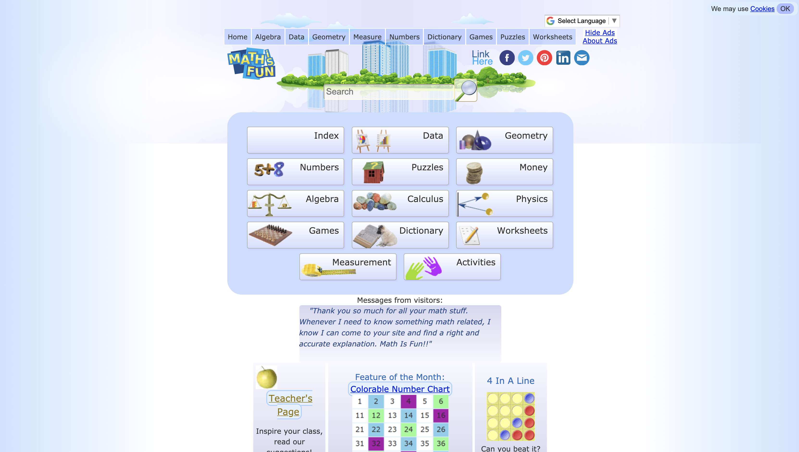

# Mathisfun.com - Web Documentation
### DH 250: UX+UI, by Garrett Romero

----
## Introduction

----
## Design Statement

----
## Competitor Analysis: Heuristic Evaluation
In the age of COVID-19, remote teaching has become mandatory for the educational world. Teachers are forced to utilize various technologies in order to facilitate and execute their lesson plans on a daily basis. The scope of this project focuses on how middle-age women, who are teachers in elementary school, engage with websites that provide supplemental academic resources for their lessons. The goal of this project is to help identify usability improvements for two website competitors that provide academic resources, which midddle-aged women who are teachers utilize on regular basis. In order to achieve the projects goal, a heuristic evaluation will be conducted to understand what works well and what are the pain points to create better remote learning experiences.

Mathantics.com | Mathisfun.com
--- | --- 
 | 

----
## Competitor Analysis: Usability Testing
In today's COVID-19 reality, remote learning has become required and additional educational resources are becoming even more important to facilitate effective this new reality. The Math is fun website is an educational resource for mathematics supplemental learning. It provides math examples, simple how-to videos, math worksheets and quizzes and more. My initial impressions are that I found the website fairly straight forward and did not overwhelm me with information based on the landing page. However, after conducting the heuristic evaluation, based on Jakob Nielsen's 10 principles, I found a few violations that potentially impacted usability of the website. Specifically:

* **User Control & Freedom:** Mathisfun does provide user control and freedom, however, it is not consistent. Upon selecting the various categories displayed (algebra, geometry, etc.) on the header bar, a user does have directional functions to move forward or backwards with the content associated to it. What becomes conflictual is that there is too much user control and freedom while simultaneously lacking it.
* **Match between system and the real world:** The child pages linking to the header bar tend to deviate from this aspect. The design logos are not placed in a uniform manner, which may have the user engage visually with the content in a left-to-right or right-to-left manner.
* **Recognition rather than recall:** The area where Mathisfun does rely on recall versus recognition is when the navigational arrows to switch between content pages become non-existent. Once the arrows are removed, then the user needs to remember how to get back to previous content that was explored.
* **Consistency and standards:** The consistency issue that should be addressed is with the horizontal direction arrows that was discussed in the ‘User control and freedom’ section.

----
## User Research: Contextual Inquiry
Based off the initial findings of the Mathisfun.com [heuristic evaluation](https://github.com/elco7985/DH250-Romero_Garrett/tree/main/Assignment%2001) and [pilot usability test](https://github.com/elco7985/DH250-Romero_Garrett/tree/main/Assignment%2002), the research has reached its next phase of data collection. The research that takes place is based on participant observation and contextual inquiry user experience methodology that is focused at collecting qualitative data towards facilitating effective math learning lessons to students in and outside of classroom learning. Specifically, the research observes and explores the tools, strategies, and pain points of teaching math to a group of elementary school children by a female, middle-aged teacher based in Los Angeles, California. The ultimate goal is to identify translatable qualitative data that can be used to help improve and/or create new features pertaining to the Mathisfun.com website.

----
## UX Storytelling
Storytelling in UX is one part research, one part artform. To craft a user's story, you need the data to bring actionable insights to light. However, data is not enough. You need to tell a story with that data to encompass the users your feature/product is targetting, which is a true artform in of itself. The purpose of storytelling in UX is simple: it is to drive design through emotion. When you are presenting a story to the stakeholders, they are not looking for granular insights from the research data. More often than not, they're looking for what makes a user frustrated and what they can do to solve that frustration. Ultimately, storytelling puts the stakeholders in the users shoes and removes any biases or assumptions they may have when they are crafting a feature or product for their consumers.
### User Personas & Empathy Map

### Customer Journey Maps

----
## Low-Fidelity Prototype

## Wireframe & Graphic Design Element Variation

## High-Fidelity Prototype

## Evaluation & Revision History

----
## Pitch Video

----
## Conclusion & Final Reflection

