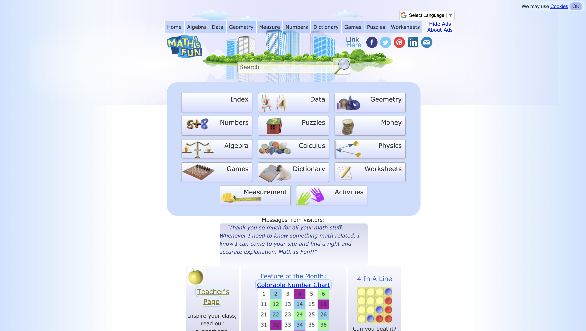

# Websites Focused in Providing Academic Resources for Teachers Who Are Middle-aged Women
## Garrett Romero - Digital Humanities 250
### Description: In the age of COVID-19, remote teaching has become mandatory for the educational world. Teachers are forced to utilize various technologies in order to facilitate and execute their lesson plans on a daily basis. The scope of this project focuses on how middle-age women, who are teachers in elementary school, engage with websites that provide supplemental academic resources for their lessons. The goal of this project is to help identify usability improvements for two website competitors that provide academic resources, which midddle-aged women who are teachers utilize on regular basis. In order to achieve the projects goal, a  heuristic evaluation will be conducted to understand what works well and what are the pain points to create better remote learning experiences.  
----
## Heuristic Evaluations
### Website Name: Mathantics
### Website URL: https://mathantics.com/
### Website Screenshot: 
### Overall Evaluation:
Recommend updating button icons to clearly define status.
### Mathantics Heuristic Evaluation
| Heuristic Principle      | Severity Ranking | Comments     |
| :---        |    :----:   | :----         |
| Visibility of system status      | 1       | The status of system is adequately conveyed on the website. When hovering over buttons with embedded hyperlinks on the website, they either change color or the cursor changes from pointer to a hand with index finger sticking out. Moreover, when engaging with the video content, it provides play/stop options and a status bar to signify whether or not the video is playing and where it is specifically on the timeline. While the system conveys status to the user, it can be hard to differentiate due to some buttons on the website not being clearly designed as buttons. A user needs to drag their cursor over some buttons in order to get a proper status conveyed. |
| Match between system and the real world   | Text        | And more      |
| User control and freedom      | Title       | Here's this   |
| Consistency and standards   | Text        | And more      |
| Error prevention      | Title       | Here's this   |
| Recognition rather than recall   | Text        | And more      |
| Flexibility and efficiency of use      | Title       | Here's this   |
| Aesthetic and minimalistic design   | Text        | And more      |
| Help users recognize, diagnose, and recover from errors      | Title       | Here's this   |
| Help and documentation   | Text        | And more      |

### Website Name: Math is fun
### Website URL: https://www.mathsisfun.com/
### Website Screenshot: 
### Overall Evaluation:
Change graphic icons to change a different color (maybe shaded backgrounded). 
### Mathantics Heuristic Evaluation
| Heuristic Principle      | Severity Ranking | Comments     |
| :---        |    :----:   | :----         |
| Visibility of system status      | Title       | System status is very well conveyed on this site. Buttons are clearly defined and change different colors when hovering over them. When engaging with the search bar, it will immediately use predictive searching and begin populating the page with results as you go along. In my opinion, this conveying to the user in real time of the search function performing the user query. Moreover, when a user is performing math equation problems on the website, it will automatically signal whether the user got it right or wrong. Where status is not clearly conveyed is through the graphic icons on the worksheet page not changing color. The cursor only changes to a hand with index finger to signify system status.  |
| Match between system and the real world   | Text        | And more      |
| User control and freedom      | Title       | Here's this   |
| Consistency and standards   | Text        | And more      |
| Error prevention      | Title       | Here's this   |
| Recognition rather than recall   | Text        | And more      |
| Flexibility and efficiency of use      | Title       | Here's this   |
| Aesthetic and minimalistic design   | Text        | And more      |
| Help users recognize, diagnose, and recover from errors      | Title       | Here's this   |
| Help and documentation   | Text        | And more      |

----
## Comparison & Analysis:
